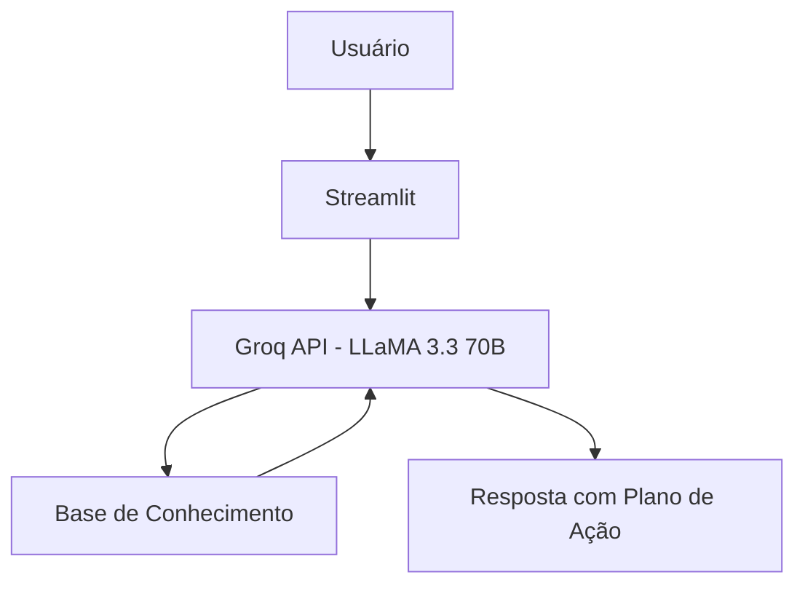

# 🎯 Rumo - Planejador de Metas Financeiras

> Agente de IA Generativa que transforma metas financeiras em planos concretos, calculando prazos e aportes mensais com base nos dados reais do usuário.

## 💡 O Que é o Rumo?

O Rumo é um assistente de planejamento financeiro que **planeja**, não recomenda. Ele calcula prazos, aponta metas inviáveis e sugere ajustes usando os dados reais de renda, gastos e metas do usuário.

**O que o Rumo faz:**
- ✅ Calcula prazos e aportes mensais para metas financeiras
- ✅ Identifica metas inviáveis no prazo desejado e sugere alternativas
- ✅ Usa dados reais do usuário para personalizar os cálculos
- ✅ Acompanha o progresso de metas ativas e concluídas

**O que o Rumo NÃO faz:**
- ❌ Não recomenda produtos financeiros ou investimentos
- ❌ Não acessa dados bancários sensíveis
- ❌ Não substitui um planejador financeiro profissional

## 🏗️ Arquitetura



**Stack:**
- Interface: Streamlit
- LLM: Groq API (modelo `llama-3.3-70b-versatile`)
- Dados: JSON/CSV mockados

## 📁 Estrutura do Projeto

```
├── assets/                        # Materiais de apoio
│
├── data/                          # Base de conhecimento
│   ├── perfil_usuario.json        # Perfil e renda do usuário
│   ├── metas.json                 # Metas ativas com progresso
│   ├── transacoes.csv             # Histórico de transações
│   └── historico_metas.csv        # Metas já concluídas
│
├── docs/                          # Documentação completa
│   ├── 01-documentacao-agente.md  # Caso de uso e persona
│   ├── 02-base-conhecimento.md    # Estratégia de dados
│   ├── 03-prompts.md              # System prompt e exemplos
│   ├── 04-metricas.md             # Avaliação de qualidade
│   └── 05-pitch.md                # Apresentação do projeto
│
└── src/
    └── app.py                     # Aplicação Streamlit
```

## 🚀 Como Executar

### 1. Configurar a API Key

Crie o arquivo `.streamlit/secrets.toml`:

```toml
GROQ_API_KEY = "sua-key-aqui"
```

> ⚠️ Crie sua key gratuita em [console.groq.com](https://console.groq.com). Nunca suba o `secrets.toml` pro GitHub.

### 2. Instalar Dependências

```bash
python3 -m venv venv
source venv/bin/activate  # Linux/Mac
pip install streamlit pandas requests
```

### 3. Rodar o Rumo

```bash
streamlit run src/app.py
```

## 🎯 Exemplo de Uso

**Pergunta:** "Quanto tempo falta pra eu juntar pra viagem?"  
**Rumo:** "Faltam R$ 6.800 para a meta de R$ 8.000. Com R$ 400/mês, você chega lá em 17 meses — por volta de março de 2027. Quer tentar antecipar aumentando o aporte mensal?"

**Pergunta:** "Consigo comprar o notebook até dezembro?"  
**Rumo:** "Não vai dar — faltam R$ 3.600 e só restam 2 meses, você precisaria de R$ 1.800/mês mas tem R$ 1.700 disponível. Quer estender o prazo para fevereiro ou a gente olha seus gastos para tentar um corte?"

## 📊 Métricas de Avaliação

| Métrica | Objetivo |
|---------|----------|
| **Precisão de cálculo** | Os prazos e aportes calculados estão corretos? |
| **Segurança** | Evita inventar valores e recomendar produtos? |
| **Coerência** | As respostas usam os dados reais do usuário? |

## 🎬 Diferenciais

- **Orientado a metas:** Foco em execução e planejamento, não em educação genérica
- **Honesto sobre inviabilidade:** Quando a meta não fecha no prazo, diz claramente e sugere ajustes
- **Público jovem:** Tom informal e direto, pensado para quem está começando a planejar
- **Seguro:** Estratégias de anti-alucinação documentadas

## 📝 Documentação Completa

Toda a documentação técnica, estratégias de prompt e casos de teste estão disponíveis na pasta [`docs/`](./docs/).
