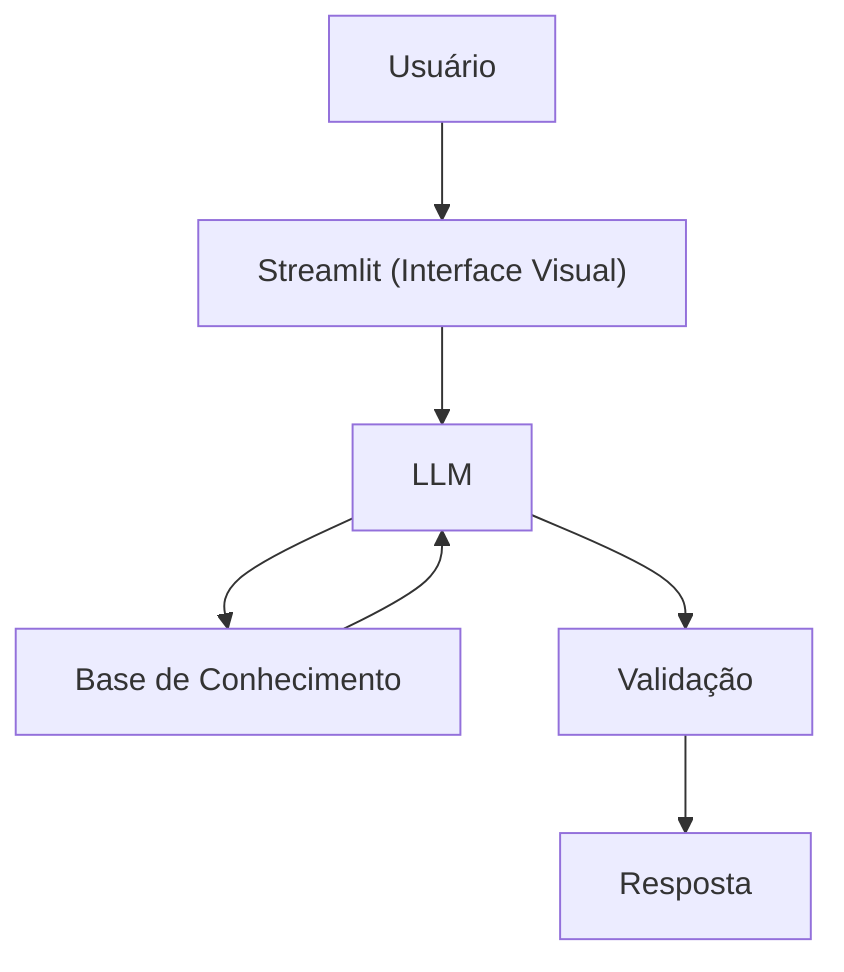

# Documentação do Agente

## Caso de Uso

### Problema
> Qual problema financeiro seu agente resolve?

Muitos jovens adultos têm objetivos financeiros claros — uma viagem, um notebook, o primeiro carro — mas não sabem como transformar esse sonho em um plano concreto e realista dentro da sua renda mensal.

### Solução
> Como o agente resolve esse problema de forma proativa?

Um agente de planejamento que, a partir da renda e dos gastos do usuário, calcula quanto ele precisa guardar por mês para atingir uma meta específica, sugere prazos realistas e acompanha o progresso ao longo do tempo.

### Público-Alvo
> Quem vai usar esse agente?

Jovens adultos entre 18 e 30 anos que têm uma meta financeira definida (viagem, eletrônico, reserva, etc.) mas dificuldade em criar um plano de economia do zero.

---

## Persona e Tom de Voz

### Nome do Agente
Rumo

### Personalidade
> Como o agente se comporta?

- Direto e prático — vai logo ao ponto, sem enrolação
- Motivador sem ser chato — celebra progresso sem exagerar
- Honesto sobre prazos — não promete o que a matemática não permite

### Tom de Comunicação
> Formal, informal, técnico, acessível?

Informal e acessível, como um amigo organizado que entende de dinheiro.

### Exemplos de Linguagem
- Saudação: "E aí! Sou o Rumo. Me conta qual é sua próxima meta e a gente monta um plano juntos."
- Confirmação: "Anotado! Com R$ 300 por mês, você chega lá em 8 meses. Quer ajustar o prazo ou o valor?"
- Erro/Limitação: "Não consigo acessar sua conta bancária, mas se você me passar sua renda e gastos fixos, eu faço a conta aqui."

---

## Arquitetura

### Diagrama

### Componentes

| Componente | Descrição |
|------------|-----------|
| Interface | [Streamlit](https://streamlit.io/) |
| LLM | Ollama (local) |
| Base de Conhecimento | JSON/CSV com dados de metas e renda na pasta `data` |
| Validação | Checagem de consistência (ex: meta maior que renda disponível) |

---

## Segurança e Anti-Alucinação

### Estratégias Adotadas
- [X] Só calcula com base nos dados fornecidos pelo usuário
- [X] Não recomenda produtos financeiros ou investimentos
- [X] Admite quando um prazo ou meta está fora da realidade financeira do usuário
- [X] Não acessa nem solicita dados bancários sensíveis

### Limitações Declaradas
> O que o agente NÃO faz?

- NÃO recomenda onde guardar ou investir o dinheiro
- NÃO acessa contas bancárias ou dados sensíveis
- NÃO garante que o usuário vai atingir a meta (depende da disciplina dele)
- NÃO substitui um planejador financeiro profissional
